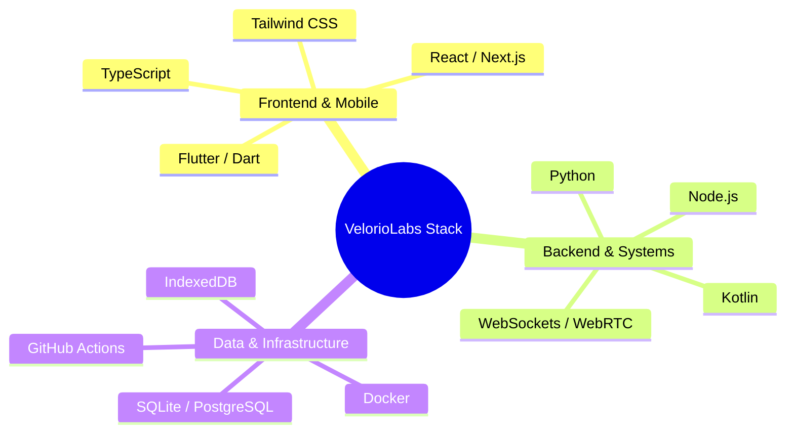

  # ⚡ Velorio Labs
  
  **Building useful software. Exploring new ideas. Shipping what matters.**

  

    
    
    
    
  

  

    <i>Velorio Labs is an independent engineering and innovation lab crafting high-performance developer tools, intelligent applications, offline-first systems, and open-source software.</i>
  

---

### 🚀 Featured Repositories & Projects

| Project | Description | Stack | Status |
| :--- | :--- | :--- | :--- |
| [**LocalDrop**](https://github.com/VelorioLabs/LocalDrop) | 🚀 Ultra-fast local-network peer-to-peer file sharing without third-party servers. | `TypeScript` `Node.js` `WebSockets` `WebRTC` | 🟢 Active |
| [**Raaga**](https://github.com/VelorioLabs/Raaga) | 🎵 Offline-first, distraction-free modern audio player with local library management. | `TypeScript` `React` `IndexedDB` `Web Audio API` | 🟢 Active |
| [**FLUXA**](https://github.com/VelorioLabs/FLUXA) | ⚡ Sleek, adaptive media streaming application and feed engine. | `Next.js` `TypeScript` `TailwindCSS` `HLS.js` | 🟢 Active |
| [**DSA Engine**](https://github.com/VelorioLabs/DSA-Engine) | 🧠 High-performance algorithms suite, step-by-step state engine, and visualizer. | `TypeScript` `Python` `Vite` `Jest` | 🟢 Active |

---

### 🧰 Technology Ecosystem

---

### 🌱 Open Source Philosophy

Our core tenets:
1. **Utility First**: Solve real problems with zero fluff and maximum developer ergonomics.
2. **Privacy & Offline First**: Empower users to own their data and operate smoothly without constant cloud dependence.
3. **Open & Transparent**: Everything is built out in the open with clean architecture, strict linting, and friendly contributor guidelines.

---

### 🤝 Join the Mission

We welcome all contributions, ideas, bug reports, and discussions!
- 📖 Read our [Contribution Guide](https://github.com/VelorioLabs/.github/blob/main/CONTRIBUTING.md)
- 🛡️ Check our [Code of Conduct](https://github.com/VelorioLabs/.github/blob/main/CODE_OF_CONDUCT.md)
- 🔒 Read our [Security Policy](https://github.com/VelorioLabs/.github/blob/main/SECURITY.md)
- 🌐 Visit our official hub: [veloriolabs.github.io](https://veloriolabs.github.io)

---

  © 2026 Velorio Labs. Built with ❤️ for open source.

